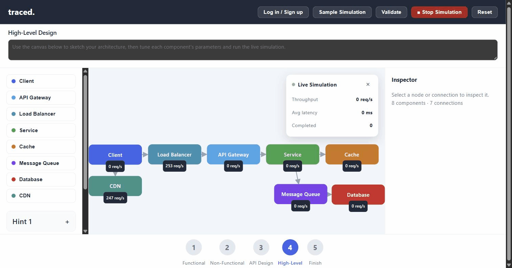

# traced

A system design sandbox where your architecture actually has to survive traffic — not just look good on a whiteboard.

Sketch a system (client → load balancer → services → cache/database/queue), hit **Run**, and watch simulated requests flow through it in real time: live throughput, latency, and per-component overload, driven by the capacity and latency you configure on each node.

**Live demo:** https://traced-frontend.onrender.com
*(free-tier hosting — the backend may take ~60–90s to wake up on the first request)*



## What it does

- Drag-and-drop canvas for wiring up system design components: Client, API Gateway, Load Balancer, Service, Cache, Message Queue, Database, CDN
- A real simulation engine, not a static diagram — requests spawn, hop across your edges, and complete or queue up based on each component's tunable capacity/latency, with live throughput and average latency stats
- A guided flow (Functional → Non-Functional → API Design → High-Level → Finish) for practicing system design interview questions end to end
- One-click **Sample Simulation** that loads a fully wired example using every component type, for a working demo with zero setup
- Accounts + cloud sync: save and reload designs against a real backend, not just local storage

## Stack

**Frontend** — React 19, Vite, plain CSS (no framework), a hand-rolled tick-based simulation engine running on `requestAnimationFrame`-scale intervals

**Backend** — Spring Boot 4 (Java 21), Spring Security with JWT auth, Spring Data JPA, WebSocket support, rate-limited auth endpoints, structured JSON logging (ECS format) with request-correlation IDs

**Data** — PostgreSQL (Neon, serverless Postgres with branching), schema managed with Flyway migrations; H2 for local dev

**Ops** — Dockerized backend, deployed on Render (Blueprint-based two-service setup: Docker web service + static site), health-checked via Spring Actuator

## Running locally

```bash
# frontend
npm install
npm run dev          # http://localhost:5173

# backend (separate terminal)
cd backend
./mvnw spring-boot:run   # http://localhost:8080, H2 file-backed DB, no setup required
```

See `docker-compose.yml` for running the full stack (frontend + backend + Postgres) in containers, and `render.yaml` for the production deployment blueprint.
